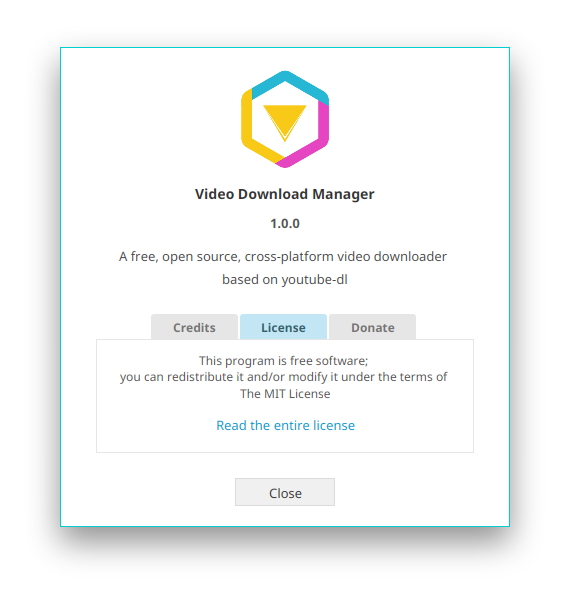

---

**Video Download Manager [VDM]** is GUI client for the popular CLI application *Youtube-dl*. It has the features you need in a video downloader application and supports a very long list of video and audio streaming websites. VDM is free, cross-platform and open source application written in *Java* and the *JavaFX* toolkit. 



Video Download Manager has the clean user interface that you can quickly get familiar with. It uses the evident colored icons to express its options. The new download options are categorized and distributed in a colored groups to provide easy and usable window with quick options picking.


With *VDM* you can download all the playlist items or select a specific items from it. You can download playlists from youtube and dailymotion, albums and groups from vimeo, courses from udemy, lynda and pluralsight, sets, playlists and stations from soundcloud and more collections from other video and audio streaming websites.


You can start new downloads immediately or you can add them to the Queue for later downloading. The Queue can be started easily from the system tray icon or by starting one of its items. Whenever you start it, VDM will downlaod its items one by one consecutively.


For more Info:

​	[videodownloadmanager.github.io](https://videodownloadmanager.github.io)


## Dependences

- JRE 8
- Python 2.7 or Python 3.x
- FFMPEG or LibAV


## How to run

- ##### Normal Mode

  ```bash
  java -jar vdm.jar        # start the program maximized
  ```

- ##### Silent Mode

  ```bash
  java -jar vdm.jar -s     # start the program minimized to tray
  ```


## License

Video Download Manager is distributed under the terms of the MIT license. See [LICENSE](LICENSE) for details. Opening a pull requests is assumed to signal agreement with these licensing terms.

